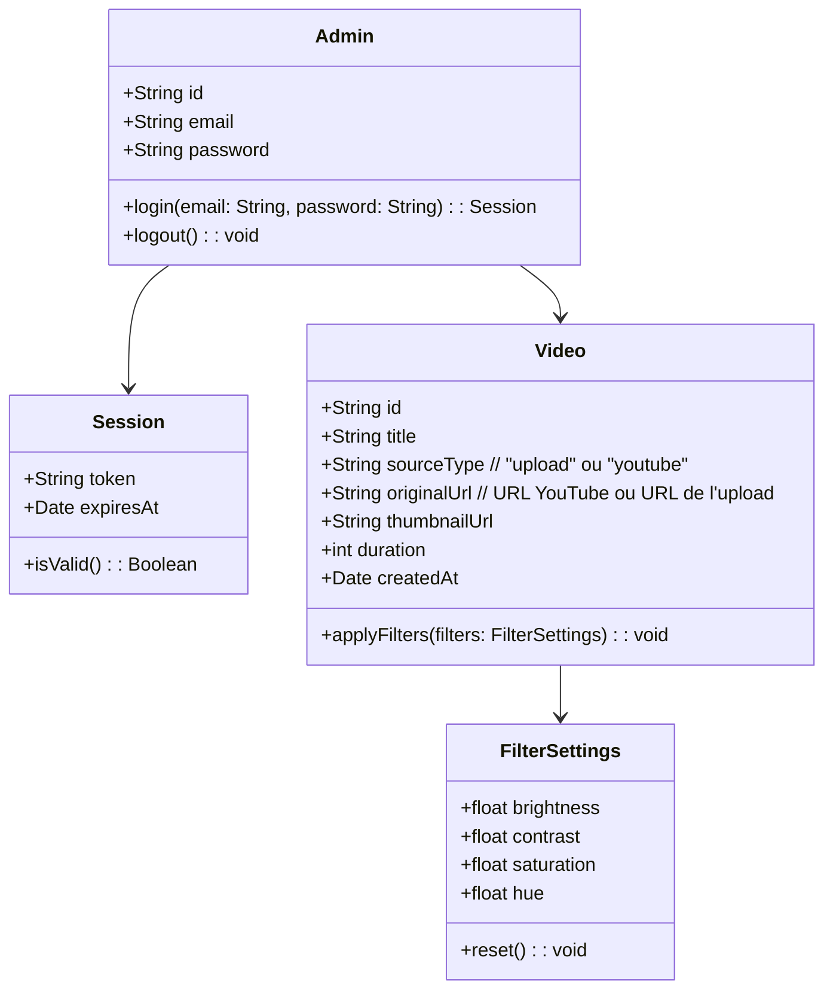

```mermaid
classDiagram
    class Admin {
        +String id
        +String email
        +String password
        +login(email: String, password: String): Session
        +logout(): void
    }

    class Session {
        +String token
        +Date expiresAt
        +isValid(): Boolean
    }

    class Video {
        +String id
        +String title
        +String sourceType     // "upload" ou "youtube"
        +String originalUrl    // URL YouTube ou URL de l'upload
        +String thumbnailUrl
        +int duration
        +Date createdAt
        +applyFilters(filters: FilterSettings): void
    }

    class FilterSettings {
        +float brightness
        +float contrast
        +float saturation
        +float hue
        +reset(): void
    }

    Admin --> Session
    Admin --> Video
    Video --> FilterSettings
```