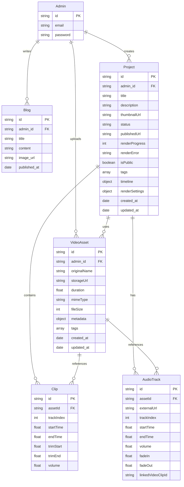

```mermaid
erDiagram
    Admin ||--o{ Blog : writes
    Admin ||--o{ Project : creates
    Admin ||--o{ VideoAsset : uploads
    Project ||--o{ VideoAsset : uses
    Project ||--o{ Clip : contains
    Project ||--o{ AudioTrack : has
    VideoAsset ||--o{ Clip : references
    VideoAsset ||--o{ AudioTrack : references

    Admin {
        string id PK
        string email
        string password
    }

    Blog {
        string id PK
        string admin_id FK
        string title
        string content
        string image_url
        date published_at
    }

    Project {
        string id PK
        string admin_id FK
        string title
        string description
        string thumbnailUrl
        string status
        string publishedUrl
        int renderProgress
        string renderError
        boolean isPublic
        array tags
        object timeline
        object renderSettings
        date created_at
        date updated_at
    }

    VideoAsset {
        string id PK
        string admin_id FK
        string originalName
        string storageUrl
        float duration
        string mimeType
        int fileSize
        object metadata
        array tags
        date created_at
        date updated_at
    }

    Clip {
        string id PK
        string assetId FK
        int trackIndex
        float startTime
        float endTime
        float trimStart
        float trimEnd
        float volume
    }

    AudioTrack {
        string id PK
        string assetId FK
        string externalUrl
        int trackIndex
        float startTime
        float endTime
        float volume
        float fadeIn
        float fadeOut
        string linkedVideoClipId
    }
```