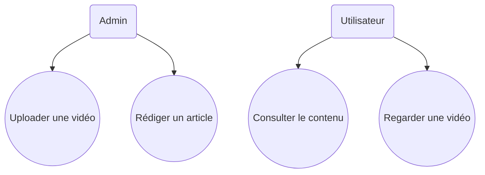

```mermaid
%% Mermaid Use Case Diagram
%% Peut être visualisé dans un éditeur compatible (ex : Obsidian, VS Code avec un plugin Mermaid)

%% Diagramme de cas d'utilisation

%% Début du diagramme
graph TD
  actorAdmin(Admin)
  actorUser(Utilisateur)

  usecase1((Uploader une vidéo))
  usecase2((Rédiger un article))
  usecase3((Consulter le contenu))
  usecase4((Regarder une vidéo))

  actorAdmin --> usecase1
  actorAdmin --> usecase2
  actorUser --> usecase3
  actorUser --> usecase4
```